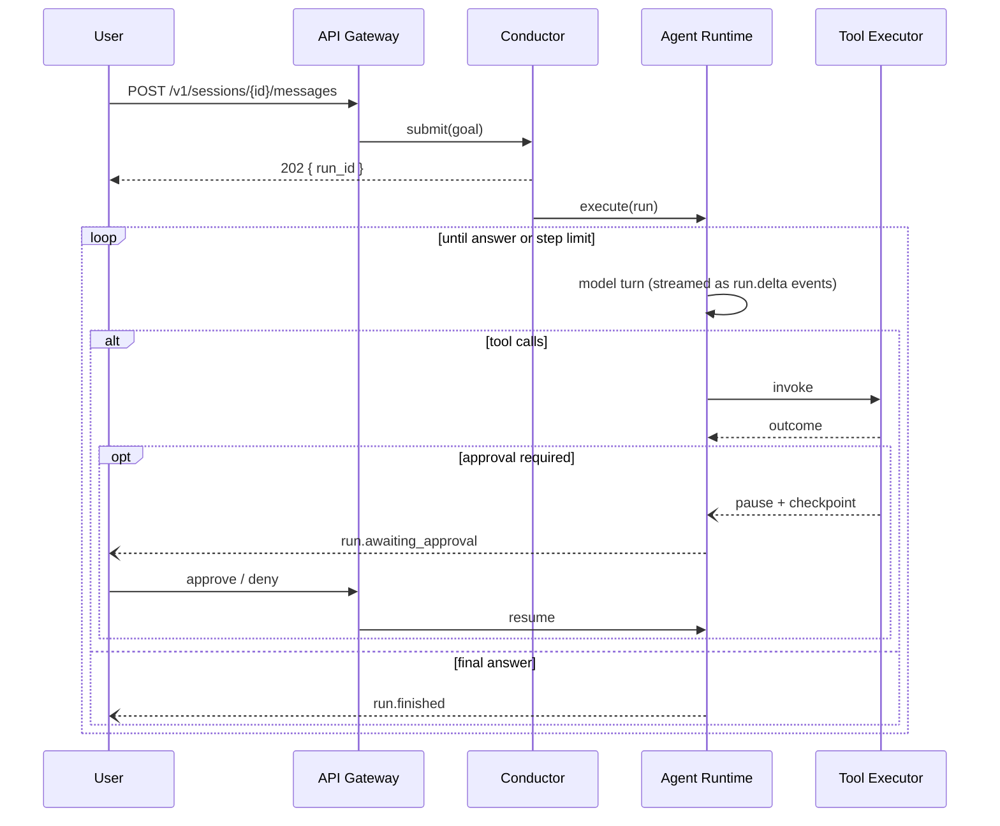

<div align="center">
  
  <h1>HoursX</h1>
  <p><strong>An autonomous AI agent platform.</strong> Goal-driven agents with tools, memory, and knowledge retrieval — plus the console to operate them.</p>
</div>

---

HoursX runs agents that pursue goals rather than answer single prompts. An agent
receives a goal, plans, calls tools, reads and writes memory, retrieves from a
knowledge base, delegates to other agents, and pauses for human approval when it
reaches something irreversible. Everything is observable while it happens and
durable afterwards.

## Highlights

| Capability | What it means |
| --- | --- |
| **Autonomous run loop** | Model ⇄ tool iteration with step budgets, streamed output, and a recorded outcome for every run |
| **Human approval gates** | Flagged tool calls suspend the run, checkpoint the transcript, and resume on a human decision |
| **Multi-agent collaboration** | Agents delegate self-contained sub-tasks to other agents and receive their answers |
| **Three-tier memory** | Per-run scratchpad, replayed conversation history, and embedding-indexed long-term notes |
| **Knowledge retrieval** | Document ingestion with hybrid vector + keyword search, available to agents as a tool |
| **Tool sandbox** | Filesystem, shell, git, code editing, HTTP, and browser tools confined to a per-session workspace |
| **Provider-agnostic models** | Anthropic, OpenAI, and any OpenAI-compatible local server, addressed by intent (`fast` / `deep`) with fallback chains |
| **Plugin SDK** | Third-party tools via entry points or a local directory, gated by operator-granted permissions |
| **Multi-user + RBAC** | Workspaces, four roles, JWT and API-key auth, per-route permission checks |
| **Real-time + durable** | WebSocket and SSE event streams; PostgreSQL as the system of record |
| **Exactly-once execution** | Compare-and-swap run claiming, heartbeats, and orphan requeue — a crashed worker never means a duplicated or lost run |
| **Fault tolerance** | Per-provider retry with jittered backoff, circuit breakers, and fallback chains |
| **Governed by quotas** | Per-workspace concurrency and hourly limits, enforced in the database across replicas |
| **Auditable** | Append-only trail of membership, credential, approval, and agent changes |
| **Three front ends** | Web console, full CLI, and a stdlib desktop GUI — all driving one runtime |
| **Self-verifying changes** | An agent declares what a change should achieve; changes that miss revert themselves, with a dead-man timer for anything that could sever access |
| **Kernel-aware** | Reads `/proc`, `/sys`, the ring buffer, modules, sysctl, cgroups, and namespaces; approved, reversible host changes |
| **Reachable anywhere** | Telegram, WhatsApp, and Gmail conversations map to persistent sessions; every accepted message ends in a delivered answer or a recorded reason |

## Quick start

### Docker Compose (full stack)

```bash
git clone <your-fork-url> hoursx && cd hoursx
cp .env.example .env          # set HOURSX_JWT_SECRET and at least one model key
docker compose up --build
```

Open **http://localhost:3400**, register the first account, create an agent, and
start a session. With no model API key configured, the deterministic `echo`
provider still exercises the full loop end to end.

### Command line (no server required)

```bash
pip install -e .
hoursx agent run "why is disk usage climbing on this host?"
hoursx system probe -v
hoursx chat            # interactive session
hoursx gui             # desktop application
hoursx doctor          # diagnose this deployment
```

Agent commands run the runtime **in-process** against SQLite, so an operator can
drive an agent on a host with nothing else provisioned.

### Local development

```bash
# Backend (http://localhost:8400, OpenAPI docs at /docs)
pip install -e ".[dev]"
hoursx db-init
hoursx serve

# Console (http://localhost:3400)
cd console
npm install
npm run dev
```

The defaults need no external services: SQLite for storage, inline execution
instead of a queue, and deterministic local embeddings. Point
`HOURSX_DATABASE_URL` at PostgreSQL and set `HOURSX_TASK_BACKEND=arq` when you
want the production shape.

### Connect real models

```bash
export HOURSX_ANTHROPIC_API_KEY=sk-ant-...
export HOURSX_MODEL_ALIASES='{"fast":"anthropic/claude-haiku-4-5","deep":"anthropic/claude-sonnet-5","embed":"openai/text-embedding-3-small"}'
```

Agents reference aliases (`deep`, `fast`), never vendor strings — swapping
providers is a configuration change, not a code change. For local inference,
set `HOURSX_LOCAL_BASE_URL` to any OpenAI-compatible endpoint (Ollama, vLLM,
LM Studio) and use `local/<model>` refs.

## How a run works



## Repository layout

```
src/hoursx/         FastAPI backend
  agents.py           run loop (model ⇄ tools, approvals, delegation)
  orchestration.py    conductor: run creation, quotas, dispatch, cancellation
  planning.py         goal → step plan
  memory.py           working / episodic / semantic memory
  knowledge.py        chunking, embedding, hybrid retrieval
  vectorstore.py      VectorStore protocol + SQL and pgvector stores
  resilience.py       retry policy and circuit breaker
  recovery.py         orphaned-run requeue (crashed-worker liveness)
  quotas.py           per-workspace concurrency and rate limits
  pagination.py       keyset cursors
  audit.py            append-only trail of consequential actions
  errors.py           domain error taxonomy → HTTP mapping
  cli/                command-line module (engine, commands, rendering)
  gui/                desktop application (Tkinter; stdlib only)
  channels/           messaging transports (Telegram, WhatsApp, Gmail) + dispatch
  remediation/        guarded change: post-conditions, ledger, auto-revert
  system/             kernel introspection, host ops, privilege envelope
  tools/              registry, policy executor, built-in tools
  providers/          model adapters + alias router
  api/                routers, dependencies, schemas
  sdk/                plugin manifest, discovery, marketplace
  db/                 SQLAlchemy models and engine
tests/              556 unit + integration tests
console/            Next.js operator console (TypeScript, Tailwind)
Dockerfile          server image (API + worker roles)
deploy/             console image and Kubernetes manifests
docs/               architecture, API, security, plugin guide, operations
```

## Documentation

- [Architecture](docs/architecture.md) — modules, contracts, and design decisions
- [API reference](docs/api.md) — endpoints, auth, events, and error shapes
- [Security model](docs/security.md) — sandboxing, RBAC, approvals, secrets
- [Plugin guide](docs/plugins.md) — build and publish a tool plugin
- [Operations](docs/operations.md) — deployment, scaling, and troubleshooting
- [System operations](docs/system-operations.md) — kernel access and the privilege envelope
- [Guarded change](docs/guarded-change.md) — post-conditions, auto-revert, and the dead-man switch
- [Channels](docs/channels.md) — Telegram, WhatsApp, and Gmail: setup, routing, and delivery

## Testing

```bash
pytest -q          # 556 tests, no network or external services
cd console && npm run typecheck && npm run build
```

The suite runs against SQLite and a scriptable deterministic model provider, so
the full run loop — including tool dispatch, approval pause/resume, and
delegation — is exercised hermetically in CI.

## License

MIT — see [LICENSE](LICENSE).
