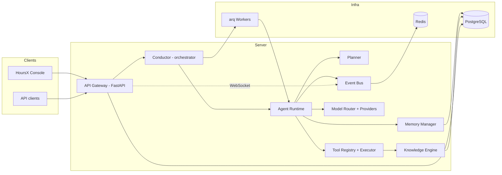
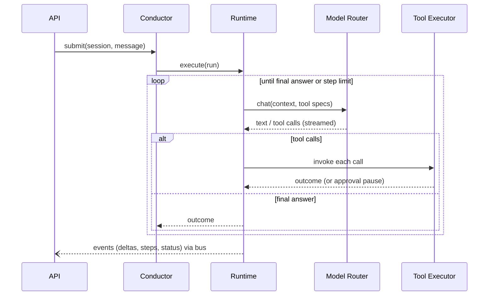

# HoursX Architecture

HoursX is an autonomous AI agent platform: a backend that runs goal-driven agents with
tools, memory, and knowledge retrieval, plus a web console for operating them. This
document is the canonical description of the system's modules, their responsibilities,
and the contracts between them.

## Design goals

1. **Modular, replaceable parts.** Every subsystem (model providers, vector stores,
   task backends, tools) is defined by a small Python protocol and selected by
   configuration. No module reaches into another module's internals.
2. **Async-first.** The entire backend is `asyncio`: FastAPI for HTTP/WebSocket,
   SQLAlchemy 2.0 async ORM, `arq` for background jobs (chosen over Celery because it
   is asyncio-native and shares the Redis connection already required for events —
   one fewer runtime model in the codebase).
3. **Event-driven where it pays.** Agent runs emit typed events on an internal bus;
   the WebSocket gateway, SSE streams, and audit logging are all subscribers. Business
   logic never talks to a socket directly.
4. **Security first.** Tools execute inside an explicit policy envelope (sandbox root,
   command allowlists, approval gates). Every API surface is authenticated; RBAC is
   enforced at the route layer; secrets never enter logs or model context.
5. **Boring persistence.** PostgreSQL is the system of record. Redis is transport
   (queues, pub/sub) — never the only copy of any fact.

## System overview



## Module map

All backend code lives under `server/src/hoursx/`.

| Module | Responsibility |
| --- | --- |
| `config` | Typed settings (`pydantic-settings`), environment-driven, no globals leaking elsewhere |
| `observability` | Structured JSON logging, request IDs, in-process counters |
| `db` | SQLAlchemy models, async engine/session factory, bootstrap |
| `auth` | Password + API-key credentials, JWT issuance, RBAC roles and permission checks |
| `events` | `EventBus` protocol; in-process bus; Redis pub/sub bridge for multi-process fanout |
| `providers` | `ModelProvider` protocol, Anthropic + OpenAI-compatible + deterministic Echo providers, `ModelRouter` |
| `prompts` | Prompt templates and the token-budgeted `ContextBuilder` |
| `memory` | Working (per-run), episodic (conversation), and semantic (embedding-backed) memory behind one `MemoryManager` |
| `knowledge` | RAG: ingestion (split → embed → store), `VectorStore` protocol, retriever |
| `tools` | `Tool` protocol, `ToolRegistry`, `ToolExecutor` (validation, timeouts, sandbox, approval gates), built-in tools |
| `agents` | `AgentProfile` and the `AgentRuntime` run loop (model ⇄ tools ⇄ memory, streaming, pause/resume) |
| `planning` | `Planner`: turns a goal into an ordered step plan via structured model output |
| `orchestration` | `Conductor`: creates runs, routes them to inline or queued execution, multi-agent delegation |
| `jobs` | arq worker: run execution, document ingestion, schedule firing |
| `scheduler` | DB-backed cron schedules fired by the worker |
| `api` | FastAPI routers, SSE + WebSocket streaming, dependency wiring |
| `sdk` | Plugin SDK: manifest schema, tool plugin base class, discovery, marketplace index format |

## Core contracts

### Model providers

```python
class ModelProvider(Protocol):
    async def complete(self, request: ChatRequest) -> ChatResult: ...
    def stream(self, request: ChatRequest) -> AsyncIterator[StreamDelta]: ...
    async def embed(self, texts: Sequence[str]) -> list[list[float]]: ...
```

Models are addressed as `provider/model` (`anthropic/claude-sonnet-5`,
`openai/gpt-5.6`, `local/llama3`). The `ModelRouter` resolves configured aliases
(`fast`, `deep`, `embed`) to concrete refs and applies fallback chains, so agent
profiles reference intent ("deep") rather than vendor strings. Local models are
served through the OpenAI-compatible provider pointed at any compatible endpoint
(Ollama, vLLM, LM Studio).

### Tools

A tool is a name, a JSON-schema parameter model, and an async `run`:

```python
class Tool(Protocol):
    spec: ToolSpec                      # name, description, pydantic params model
    async def run(self, call: ToolInvocation, ctx: ToolContext) -> ToolOutcome: ...
```

The `ToolExecutor` owns everything around the call: argument validation against the
schema, per-tool timeout, workspace sandbox enforcement, and the **approval gate** —
tools marked `requires_approval` (or matching an operator policy) suspend the run,
persist an `ApprovalRequest`, and resume only on an explicit human decision. Tool
outcomes are structured (`ok`/`error` + payload + user-visible summary) so the model
always receives something actionable, never a bare stack trace.

### Agent run loop

A **run** is one goal-directed execution of an agent inside a session:



Run states: `queued → running → (awaiting_approval ⇄ running) → succeeded | failed |
cancelled`. Every state transition is persisted and emitted as an event — a run can
never end in silence.

### Multi-agent collaboration

Collaboration is modeled as **delegation**: an agent whose profile allows it gets an
`agent.delegate` tool that starts a child run under another profile and returns that
run's final answer. Child runs share the session's knowledge scope but have their own
step budget. This keeps orchestration composable (the planner can emit delegation
steps) without a bespoke inter-agent protocol.

### Memory

- **Working memory** — mutable per-run scratchpad, discarded at run end.
- **Episodic memory** — the persisted conversation history, replayed into context
  under a token budget (newest-first trimming).
- **Semantic memory** — embedding-indexed long-term notes (`memory.save` /
  `memory.search` tools, automatic recall into context at run start).

### Knowledge (RAG)

Documents are ingested asynchronously: split into overlapping chunks, embedded via
the router's `embed` alias, stored through the `VectorStore` protocol. The default
store keeps embeddings in PostgreSQL and scores cosine + keyword-overlap in the
retriever; a pgvector-backed store is a drop-in replacement behind the same protocol
for larger corpora.

### Events

Every event is a typed envelope: `{type, workspace_id, run_id?, session_id?, payload,
at}`. Producers publish to the in-process bus; when Redis is configured the bus
bridges to pub/sub so any API replica can serve any WebSocket client. Event types are
a closed set (`run.started`, `run.delta`, `run.step`, `run.awaiting_approval`,
`run.finished`, `approval.decided`, `document.ingested`, `schedule.fired`, ...).

## Persistence model

Single PostgreSQL database (SQLite for tests/dev), all tables owned by SQLAlchemy
models in `hoursx.db.models`:

`users`, `api_keys`, `workspaces`, `workspace_members` (role), `agent_profiles`,
`sessions`, `messages`, `runs`, `run_steps`, `approval_requests`, `memory_items`,
`documents`, `document_chunks`, `schedules`, `plugin_installs`.

## Execution backends

`HOURSX_TASK_BACKEND` selects how runs and ingestion execute:

- `inline` (default for dev/tests): awaited in the API process.
- `arq`: enqueued to Redis; `hoursx worker` processes execute them. The scheduler is
  an arq cron job that fires due DB schedules once per minute.

## Plugin SDK

Plugins extend the tool surface. A plugin is a Python package exposing a
`hoursx.plugins` entry point (or dropped into the local plugin directory) that returns
a `PluginManifest`: identity, version, permissions it needs, and the tools it
provides. The registry loads manifests at startup, gates tools by the permissions the
operator granted at install time, and records installs in `plugin_installs`. The
marketplace is a static JSON index (name, version, source, checksum, permissions) —
the server can list a remote index and install from it; no code runs at install time.

## Security model

- JWT bearer auth for humans, hashed API keys for machines; both resolve to a user +
  workspace role.
- Roles: `owner > admin > member > viewer`, each mapped to a permission set checked
  at the route layer (`require(Permission.X)` dependencies).
- Tool sandbox: filesystem tools are confined to the session workspace root
  (realpath-checked); shell execution is deny-by-default outside the sandbox and
  subject to a command policy; network tools respect an allowlist.
- Approval workflow for irreversible or operator-flagged actions.
- Secrets live only in settings/env; log formatter redacts known secret fields.

## Reliability guarantees

**Single-winner run claiming.** A run transitions to `running` through a
compare-and-swap (`UPDATE … WHERE id = ? AND status = 'queued'`), and the loop
proceeds only if it changed exactly one row. Two workers pulling the same job
cannot both execute it — which matters because agent side effects (files, shell
commands, spend) are not idempotent.

**Orphan recovery.** Single-winner claiming needs a matching liveness rule: a
worker that dies mid-run would otherwise leave the row `running` forever. The
runtime heartbeats each claimed run; a sweep re-queues runs whose heartbeat has
gone stale. `awaiting_approval` is excluded — it waits on a human, not a worker.

**Cooperative cancellation.** Cancellation sets a flag the loop observes at step
boundaries rather than killing the task, so a tool never dies half-applied. Runs
parked on approval are settled directly, since no loop is polling for them.

**Idempotent submission.** A client-supplied idempotency key makes a retried
submission return the original run instead of starting a second one.

**Provider resilience.** Transient failures (timeouts, 429, 5xx) retry with
jittered exponential backoff; permanent ones (bad credentials, unknown model)
fail immediately. Each provider has a circuit breaker, so a dead vendor is
skipped instantly while a healthy fallback exists.

**Quotas.** Per-workspace concurrency and hourly limits are enforced against the
database, so the limit holds across API replicas and survives restarts.

## Deployment

`docker-compose.yml` runs the full stack (PostgreSQL, Redis, API, worker, console).
Kubernetes manifests in `deploy/k8s/` provide Deployments for api/worker/console,
a ConfigMap-driven environment, and readiness probes on `/readyz`. CI builds and
tests both packages on every push.
