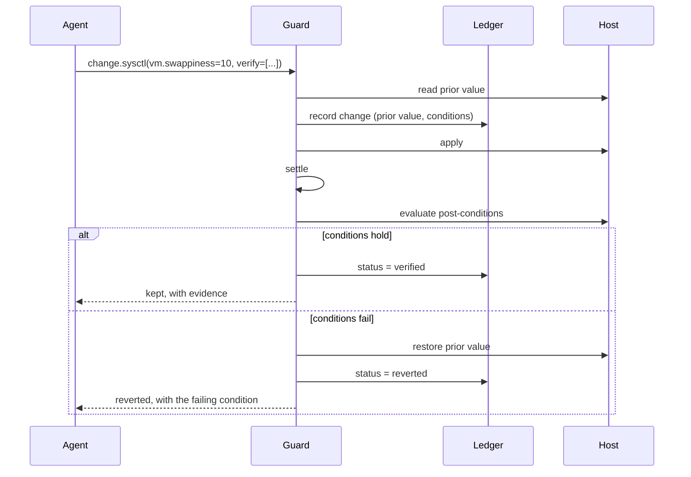

# Guarded Change

An agent that can change a host but cannot tell whether the change *worked* is
only half a tool. Guarded change closes that loop: the agent states what should
become true, and the platform holds it to that claim.

A change that does not produce its stated effect is reverted automatically,
using the value captured before it was applied.

## The sequence



The ordering is deliberate:

- **Prior state is read first**, so the revert path exists before anything is
  touched.
- **The ledger row is written before the change is applied**, so a crash between
  apply and record cannot strand an unrecorded mutation.
- **Settle precedes verify**, because kernel tunables and services do not take
  effect instantly and verifying immediately would measure the old state and
  revert a perfectly good change.
- **Unverifiable counts as failed.** If a probe cannot read what it needs, the
  change is reverted rather than assumed good — a change whose effect cannot be
  confirmed is not one worth keeping.

## Post-conditions

Conditions are **data, never code**. The agent picks a probe from a closed set,
names a target, and states a comparison. Nothing model-authored is ever
evaluated as an expression — `eval` inside a component that also holds host
privileges is precisely the bug this subsystem exists to prevent.

```json
{
  "key": "vm.vfs_cache_pressure",
  "value": "150",
  "verify": [
    {"probe": "sysctl_value", "target": "vm.vfs_cache_pressure", "operator": "eq", "value": "150"},
    {"probe": "memory_used_percent", "operator": "lt", "value": 85},
    {"probe": "disk_used_percent", "target": "/", "operator": "lt", "value": 90}
  ],
  "settle_seconds": 5
}
```

| Probe | Target | Observes |
| --- | --- | --- |
| `memory_used_percent` | — | Memory in use, as a percentage |
| `load_1m` / `load_5m` | — | Load average |
| `process_count` | — | Number of processes |
| `open_file_descriptors` | — | Allocated file descriptors |
| `disk_used_percent` | mountpoint | Filesystem usage |
| `disk_free_bytes` | mountpoint | Free space |
| `sysctl_value` | dotted key | A kernel parameter |
| `port_listening` | port number | Whether something listens there |
| `process_running` | process name | Whether it is running |
| `service_active` | unit name | Whether the unit is active |

Operators: `lt`, `lte`, `gt`, `gte`, `eq`, `ne`.

Comparison coerces where it is unambiguous, because `/proc` returns strings
(`"10"`, `"active"`) while a model naturally writes numbers and booleans. A
correct condition should not be rejected over a type mismatch its author could
not reasonably anticipate. Ordering a pair of non-numeric values raises rather
than quietly returning false — silently "failing" a nonsense condition would
trigger a revert for the wrong reason.

## The dead-man switch

Some changes can sever the operator's own access — and if you are locked out,
you cannot issue the revert. So the revert has to be armed *before* the change
and fire on silence:

```json
{"unit": "nftables", "action": "restart", "revert_after_seconds": 120}
```

The change reverts in two minutes unless a human confirms it. This is the
software equivalent of `reload in 5`. A worker cron sweeps expired changes once
a minute.

Confirm from any surface:

```bash
hoursx changes confirm <id>
curl -XPOST localhost:8400/v1/changes/<id>/confirm -H "authorization: Bearer $TOKEN"
```

Unrevertible actions never receive an expiry — arming a timer that cannot fire
would be a false promise.

## What can and cannot be undone

| Change | Inverse |
| --- | --- |
| `sysctl` write | Restore the exact recorded prior value |
| service `start` / `stop` | The opposite action |
| service `enable` / `disable` | The opposite action |
| service `restart` / `reload` | **None** — recorded as `unrevertible` |

`restart` and `reload` have no meaningful undo, and the ledger says so rather
than pretending. Discovering that during an incident would be much worse than
being told upfront.

## Change states

```
applied ──────────► verified ──────► confirmed
   │                    │
   │                    └──────────► reverted
   ├──► reverted (post-conditions failed, or window elapsed)
   ├──► revert_failed (the safety net itself failed — investigate)
   └──► unrevertible (applied, no inverse exists)
```

`revert_failed` is the state that matters most: the change stuck *and* the undo
failed, so the host is in a state nobody chose. It is logged at error level and
the tool result says explicitly which target may be left at which value.

## Using it

**Agent tools** — `change.sysctl`, `change.service`, `change.list`,
`change.revert`, `change.confirm`. The mutating ones require human approval, as
all host mutations do; the operator sees the arguments *and the declared
post-conditions* before deciding.

**CLI**

```bash
hoursx changes list
hoursx changes revert <id>
hoursx changes confirm <id>
```

**API** — `GET /v1/changes`, `POST /v1/changes/{id}/revert`,
`POST /v1/changes/{id}/confirm`. Listing needs `observe`; reverting and
confirming need `runs.approve`. Both mutations are audited.

The operator path exists deliberately and does not go through the agent, because
the moment you most need to undo an agent's change is the moment you least want
to ask the agent to do it.

## Relationship to the privilege envelope

Guarded change does not decide *whether* something is permitted — that is
[`docs/system-operations.md`](system-operations.md), and it has already run by
the time a guard is invoked. A refused sysctl is refused here too, verification
or not.

The two layers compose: privileges decide **may this happen**, the guard decides
**did it work, and if not, put it back**.

## Testing

```bash
pytest tests/test_conditions.py tests/test_guarded_change.py -q
```

The guard is tested against a stubbed host so every branch — failed apply, failed
verification, failed *revert*, expiry, confirmation — is deterministic. Rewriting
real kernel parameters from a test suite would be both flaky and irresponsible.
